# Adding an Amazon RDS DB instance to SSM

The *SSM Add Instance* is now a preferred method of adding an Amazon RDS DB instance to SSM. This method supports Amazon RDS DB instances that use Amazon Aurora, MySQL, or MariaDB engines.

[TOC]

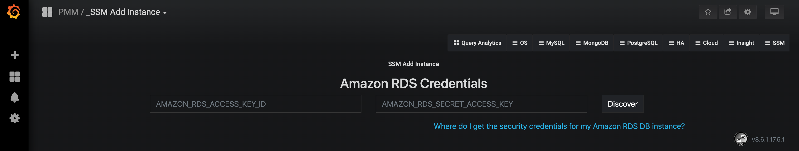

*Enter the access key ID and the secret access key of your IAM user to view Amazon RDS DB instances.*

1. Open the SSM web interface and select the *SSM Add Instance* dashboard.
2. Select the Add an AWS RDS MySQL or Aurora MySQL Instance option in the dashboard.
3. Enter the access key ID and the secret access key of your IAM user.
4. Click the Discover button for SSM to retrieve the available Amazon RDS instances.

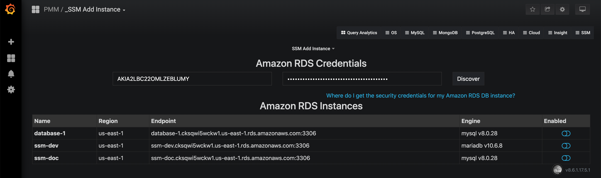

For each instance that you would like to monitor, select the Enabled button and enter the user name and password. Click Connect. You can now monitor your instances in the *Amazon RDS / Aurora MySQL Metrics*.

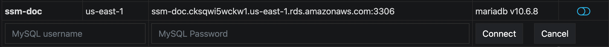

## Essential AWS settings for monitoring Amazon RDS DB instances in SSM

It is possible to use SSM for monitoring Amazon RDS (just like any remote MySQL instance). In this case, the SSM Client is not installed on the host where the database server is deployed. By using the SSM web interface, you connect to the Amazon RDS DB instance. You only need to provide the IAM user access key (or assign an IAM role) and SSM discovers the Amazon RDS DB instances available for monitoring.

First of all, ensure that there is the minimal latency between SSM Server and the Amazon RDS instance.

Network connectivity can become an issue for Prometheus to scrape metrics with 1 second resolution.  We strongly suggest that you run SSM Server on in the same availability zone as Amazon RDS instances.

It is crucial that *enhanced monitoring* be enabled for the Amazon RDS DB instances you intend to monitor.


### Creating an IAM user with permission to access Amazon RDS DB instances

It is recommended that you use an IAM user account to access Amazon RDS DB instances instead of using your AWS account. This measure improves security as the permissions of an IAM user account can be limited so that this account only grants access to your Amazon RDS DB instances. On the other hand, you use your AWS account to access all AWS services.

The procedure for creating IAM user accounts is well described in the Amazon RDS documentation. This section only goes through the essential steps and points out the steps required for using Amazon RDS with Shattered Silicon Monitoring.

The first step is to define a policy which will hold all the necessary permissions. Then, you need to associate this policy with the IAM user or group. In this section, we will create a new user for this purpose.

### Creating a policy

A policy defines how AWS services can be accessed. Once defined it can be associated with an existing user or group.

To define a new policy use the IAM page at AWS.

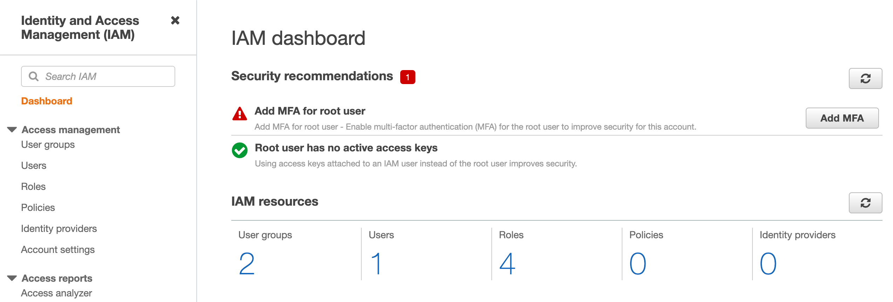

1. Select the Policies option on the navigation panel and click the Create policy button.

2. On the Create policy page, select the JSON tab and replace the existing contents with the following JSON document.

    ```
    {
        "Version": "2012-10-17",
        "Statement": [
            {
                "Sid": "Stmt1664804420",
                "Effect": "Allow",
                "Action": [
                    "rds:DescribeDBInstances",
                    "rds:DescribeDBParameters",
                    "rds:DescribeDBLogFiles",
                    "rds:DownloadDBLogFilePortion",
                    "rds:DescribeDBClusters",
                    "rds:DescribeDBClusterParameters",
                    "cloudwatch:GetMetricStatistics",
                    "cloudwatch:ListMetrics"
                ],
                "Resource": [
                    "*"
                ]
            },
            {
                "Sid": "Stmt1664804472",
                "Effect": "Allow",
                "Action": [
                    "logs:DescribeLogStreams",
                    "logs:GetLogEvents",
                    "logs:FilterLogEvents"
                ],
                "Resource": [
                    "arn:aws:logs:*:*:log-group:RDSOSMetrics:*"
                ]
            }
        ]
    }
    ```

3. Click **Next: Tags** and add any tag you like (such as **ssm**)

4. Click **Next: Review** and set a name to your policy, such as **AmazonRDSforSSMPolicy**. Then, click the **Create policy** button.

    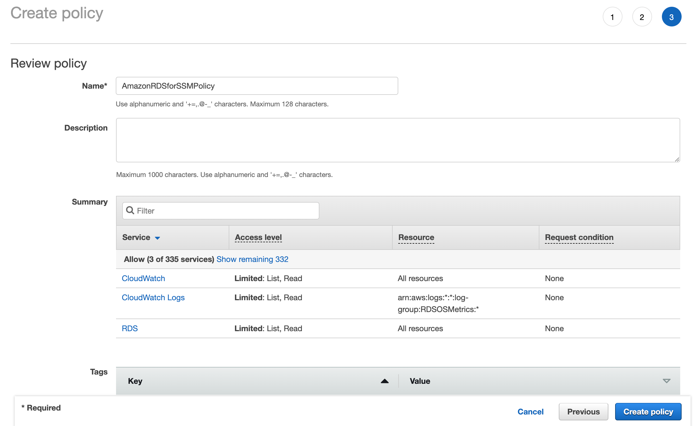

    *A new policy is ready to be created.*

#### Creating an IAM group (Optional)

To create a new IAM group, select **Users groups** on the Identity and Access Management page at AWS. Then click **Create group** and complete the following steps:

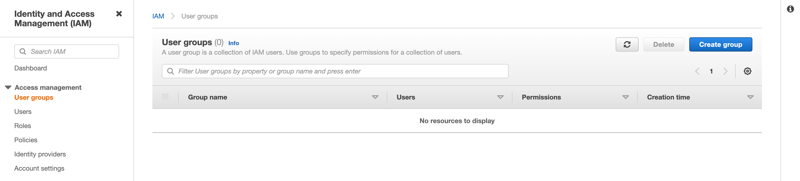

1. On the Create user group page, set the group name (such as **SSM**), and use the Filter under *Attach permissions policies*, locate the policy with the required permissions (such as **AmazonRDSforSSMPolicy**), select a checkbox next to the name of the policy. Then click **Create group**
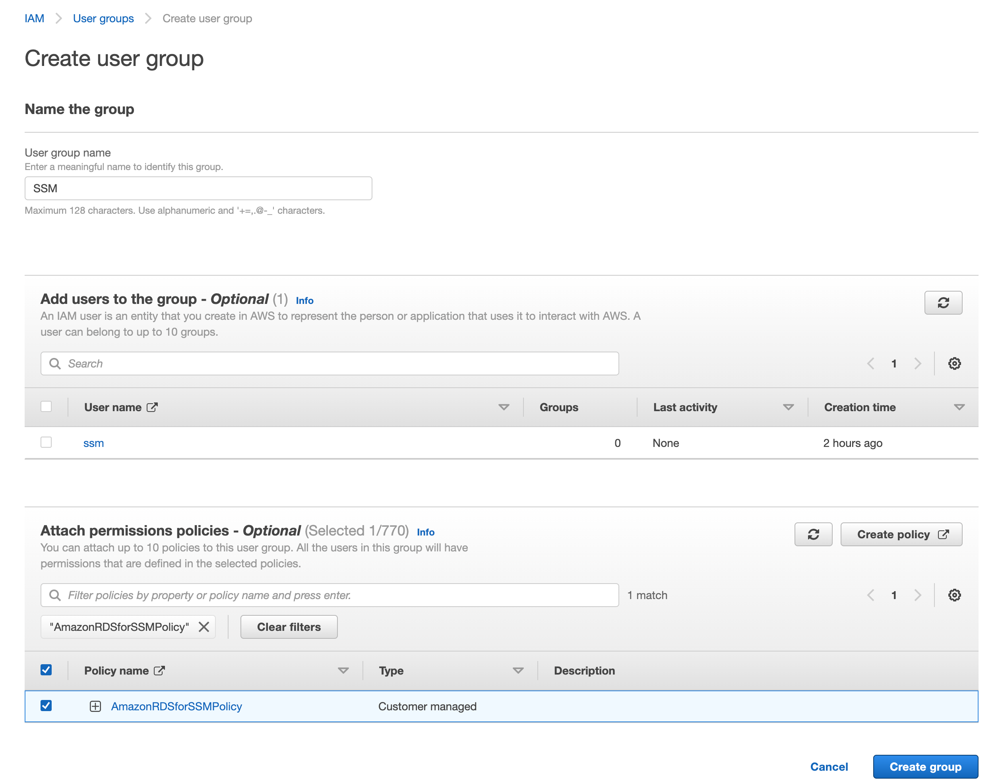

#### Creating an IAM user

To create a new IAM user, select **Users** on the Identity and Access Management page at AWS. Then click **Add user** and complete the following steps:

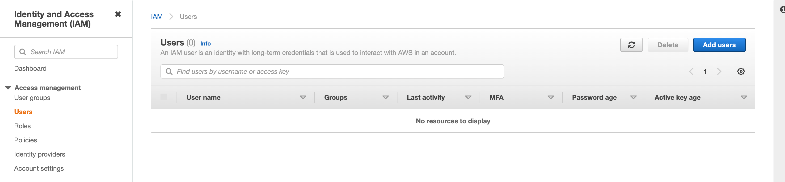

1. On the Add user page, set the user name and select the Programmatic access option under Select AWS access type. And select the AWS Management Console access option if necessary. Then click the **Next: Permissions**.
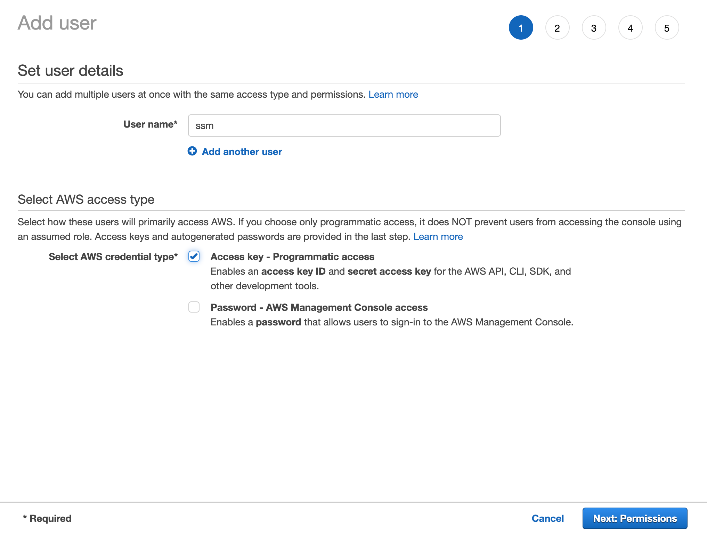

2. On the Set permissions page, if you have created a group following this [step](#creating-an-iam-group-optional), select **Add user to group**, add the new user to that group, and more groups if necessary. If you haven't created such group, then select **Attach existing policies**, use the Filter, locate the policy with the required permissions (such as **AmazonRDSforSSMPolicy**), select a checkbox next to the name of the policy. Then click **Next: Tags**.
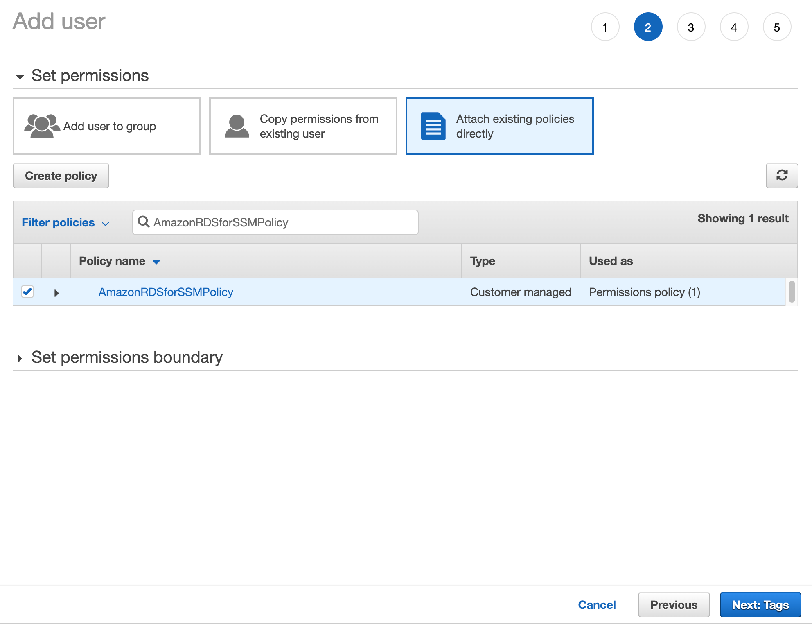

3. On the Add tags page, add any tag you like, such as **ssm**. Then click **Next: Review**

4. On the Review page, make sure everything is right, and then click **Create User**.

5. On the Success page, save the **Access key ID** and **Secret access key**, which you can provide on the **SSM Add Instance** dashboard to have your Amazon RDS DB instances discovered.

!!! alert alert-warning "Important"
    You may use an IAM role instead of IAM user provided your Amazon RDS DB instances are associated with the same AWS account as SSM.

In case, the SSM Server and Amazon RDS DB instance were created by using the same AWS account, you do not need create the access key ID and secret access key manually. SSM retrieves this information automatically and attempts to discover your Amazon RDS DB instances.

### Setting up the Amazon RDS DB Instance

#### Configuring slow query log

Select **Parameter groups** on the Amazon RDS page at AWS, click the parameter group you want to use and complete the following steps:

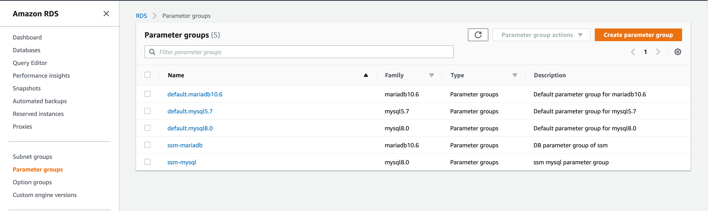

1. Click **Edit parameters** first, then use Filter to locate **slow_query_log**, set its value to **1** to enable slow query log.
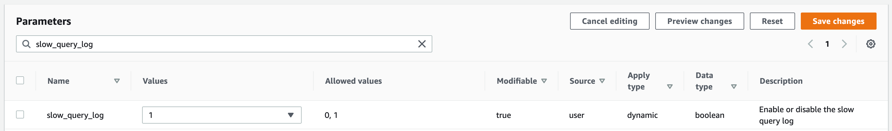

2. Use Filter to locate **log_output**, set its value to **FILE** to log query in file.
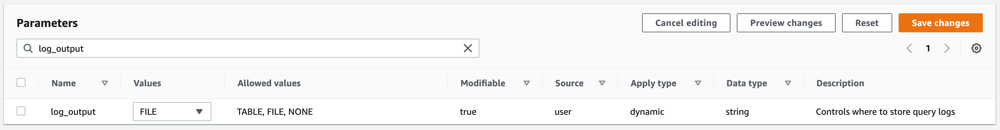

3. Use Filter to locate **long_query_time**, set its value to **0** to log every query.
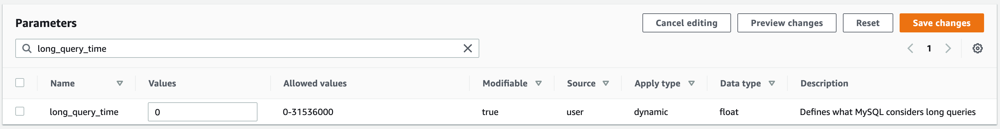

#### Configuring performance schema (Optional)

Slow query log is the default query source for Query Analytics. If you prefer using performance schema, here is what you should do:

1. Select Parameter groups on the Amazon RDS page at AWS, click the parameter group you want to use.


2. Click **Edit parameters** first, then use Filter to locate **performance_schema**, set its value to **1**.
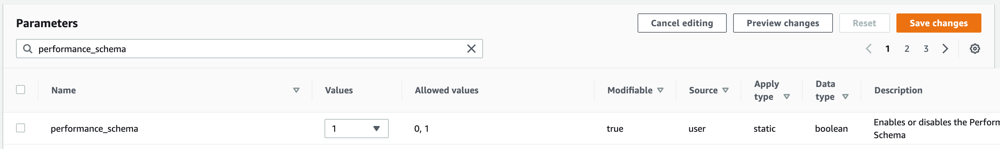

!!! alert alert-warning "Warning"
    Enabling Performance Schema on T2 instances is not recommended because it can easily run the T2 instance out of memory.

When adding a monitoring instance for Amazon RDS, specify a unique name to distinguish it from the local MySQL instance.  If you do not specify a name, it will use the client’s host name.

Create the `ssm` user with the following privileges on the Amazon RDS instance that you want to monitor:

```
CREATE USER IF NOT EXISTS 'ssm'@'%' IDENTIFIED BY 'pass' WITH MAX_USER_CONNECTIONS 10;
GRANT SELECT, PROCESS, REPLICATION CLIENT, SHOW VIEW, SLAVE MONITOR ON *.* TO 'ssm'@'%';
GRANT SELECT, UPDATE, DELETE, DROP ON performance_schema.* TO 'ssm'@'%';
```

!!! alert-alert-info "Note"
    General system metrics are monitored by using the **rds_exporter**, a Prometheus exporter which replaces **node_exporter**. **rds_exporter** harvests data from Amazon Cloudwatch metrics.

!!! seealso "See also"
    Amazon RDS Documentation:
    - [Creating an IAM user](https://docs.aws.amazon.com/AmazonRDS/latest/UserGuide/CHAP_SettingUp.html#CHAP_SettingUp.IAM)
    - [Creating IAM policies](https://docs.aws.amazon.com/IAM/latest/UserGuide/access_policies_create.html)
    - [Managing access keys of IAM users](https://docs.aws.amazon.com/IAM/latest/UserGuide/id_credentials_access-keys.html)
    - [Modifying an Amazon RDS DB Instance](https://docs.aws.amazon.com/AmazonRDS/latest/UserGuide/Overview.DBInstance.Modifying.html)
    - [More information about enhanced monitoring](https://docs.aws.amazon.com/AmazonRDS/latest/UserGuide/USER_Monitoring.OS.html)
    - [Setting Up](https://docs.aws.amazon.com/AmazonRDS/latest/UserGuide/CHAP_SettingUp.html)
    - [Getting started](https://docs.aws.amazon.com/AmazonRDS/latest/UserGuide/CHAP_GettingStarted.html)
    - [Creating a MySQL DB Instance](https://docs.aws.amazon.com/AmazonRDS/latest/UserGuide/CHAP_GettingStarted.CreatingConnecting.MySQL.html)
    - [Connecting to a DB instance (MySQL engine)](https://docs.aws.amazon.com/AmazonRDS/latest/UserGuide/USER_ConnectToInstance.html)
    - [Availability zones](https://docs.aws.amazon.com/AWSEC2/latest/UserGuide/using-regions-availability-zones.html)
    - [What privileges are automatically granted to the master user of an Amazon RDS DB instance?](https://docs.aws.amazon.com/AmazonRDS/latest/UserGuide/UsingWithRDS.MasterAccounts.html)

   Which ports should be open?
   : See [Ports](glossary.terminology.md#ports) in glossary
