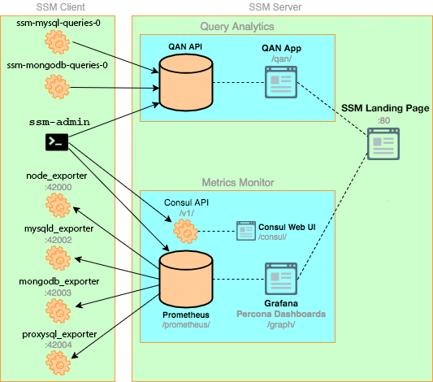

# Overview of Shattered Silicon Monitoring and Management Architecture

SSM is built as a client-server application comprising these modules:

- SSM Client installed on every database host that you want to monitor. It collects server metrics, general system metrics, and Query Analytics data for a complete performance overview.

- SSM Server is the central part of SSM that aggregates collected data and presents it in the form of tables, dashboards, and graphs in a web interface.

The modules are packaged for easy installation and usage. It is assumed that the user should not need to understand what are the exact tools that make up each module and how they interact. However, if you want to leverage the full potential of SSM, the internal structure is important.

[TOC]

SSM is a collection of tools designed to seamlessly work together.  Some are developed by Shattered Silicon and some are third-party open-source tools.

!!! alert alert-info "Note:
    The overall client-server model is not likely to change, but the set of tools that make up each component may evolve with the product.

The following diagram illustrates how SSM is currently structured:



## SSM Client

Each SSM Client collects various data about general system and database performance, and sends this data to the corresponding SSM Server.

The SSM Client package consist of the following:

* **ssm-admin** is a command-line tool for managing SSM Client, for example, adding and removing database instances that you want to monitor. For more information, see [Managing SSM Client](ssm-admin.md).
* `ssm-mysql-queries-0` is a service that manages the QAN agent as it collects query performance data from MySQL and sends it to the QAN API on [SSM Server](glossary.terminology.md#ssm-server).
* `ssm-mongodb-queries-0` is a service that manages the QAN agent as it collects query performance data from MongoDB and sends it to QAN API on [SSM Server](glossary.terminology.md#ssm-server).
* **node_exporter** is a Prometheus exporter that collects general system metrics.
* **mysqld_exporter** is a Prometheus exporter that collects MySQL server metrics.
* **mongodb_exporter** is a Prometheus exporter that collects MongoDB server metrics.
* **proxysql_exporter** is a Prometheus exporter that collects ProxySQL performance metrics.

!!! seealso "See also"

    How to install SSM Client
    : [Installing Clients](deploy/index.md)

    How to pass exporter specific options when adding a monitoring service
    : [Passing options to the exporter](ssm-admin.md)

    List of available exporter options
    : [Exporters Overview](index.exporter-option.md)

## SSM Server

SSM Server runs on the machine that will be your central monitoring host. It is distributed as an appliance via the following:

* Docker image that you can use to run a container
* OVA that you can run in VirtualBox or another hypervisor
* AMI that you can run via Amazon Web Services

For more information, see [Installing SSM Server](deploy/index.md#installing-ssm-server).

SSM Server includes the following tools:

* Query Analytics enables you to analyze MySQL query performance over periods of time. In addition to the client-side QAN agent, it includes the following:

    * QAN API is the backend for storing and accessing query data collected by the QAN agent running on a [SSM Client](glossary.terminology.md#ssm-client).
    * QAN Web App is a web application for visualizing collected Query Analytics data.

* Metrics Monitor provides a historical view of metrics that are critical to a MySQL or MongoDB server instance. It includes the following:

    * Prometheus is a third-party time-series database that connects to exporters running on a [SSM Client](glossary.terminology.md#ssm-client) and aggregates metrics collected by the exporters.  For more information, see [Prometheus Docs](https://prometheus.io/docs/introduction/overview/).

        * Consul provides an API that a [SSM Client](glossary.terminology.md#ssm-client) can use to remotely list, add, and remove hosts for Prometheus.  It also stores monitoring metadata.  For more information, see [Consul Docs](https://www.consul.io/docs/).

            !!! warning
                Although the Consul web UI is accessible, do not make any changes to the configuration.

    * Grafana is a third-party dashboard and graph builder for visualizing data aggregated by Prometheus in an intuitive web interface.  For more information, see [Grafana Docs](http://docs.grafana.org/).

        * Shattered Silicon Dashboards is a set of dashboards for Grafana developed by Shattered Silicon.

* Orchestrator is a MySQL replication topology management and visualization tool. For more information, see: [Orchestrator Manual](https://github.com/outbrain/orchestrator/wiki/Orchestrator-Manual).

All tools can be accessed from the SSM Server web interface (landing page). For more information, see [Tools of SSM](tool.md).


!!! seealso "See also"

    Default ports
    : Ports in [Terminology Reference](glossary.terminology.md#ports)

    Enabling orchestrator
    : Orchestrator [Terminology Reference](glossary.terminology.md#orchestrator)

## Orchestrator

Orchestrator is a MySQL replication topology management and visualization tool.  If it is enabled, you can access it using the `/orchestrator` URL after SSM Server address.  Alternatively, you can click the MySQL Replication Topology Manager button on the SSM Server landing page.

To use it, create a MySQL user for Orchestrator on all managed instances:

```
GRANT SUPER, PROCESS, REPLICATION SLAVE, RELOAD ON *.*
TO 'orc_client_user'@'%'
IDENTIFIED BY 'orc_client_password’;
```

!!! alert alert-info "Note"
    The credentials in the previous example are default. If you use a different user name or password, you have to pass them when running SSM Server using the `ORCHESTRATOR_PASSWORD` and `ORCHESTRATOR_USER` options.

    ```
    $ docker run ... -e ORCHESTRATOR_ENABLED=true ORCHESTRATOR_USER=name -e ORCHESTRATOR_PASSWORD=pass ... ssm/ shatteredsilicon/ssm-server:1
    ```

Then you can use the *Discover* page in the Orchestrator web interface to add the instances to the topology.

!!! alert alert-info "Note"
    **Orchestrator is not enabled by default starting with SSM 1.3.0**

    Orchestrator was included into SSM for experimental purposes.  It is a standalone tool, not integrated with SSM other than that you can access it from the landing page.

    In version 1.3.0 and later, Orchestrator is not enabled by default. To enable it, see [Additional options](deploy/server/docker.setting-up.md) in the [Running SSM Server via Docker](deploy/server/docker.md) section.
