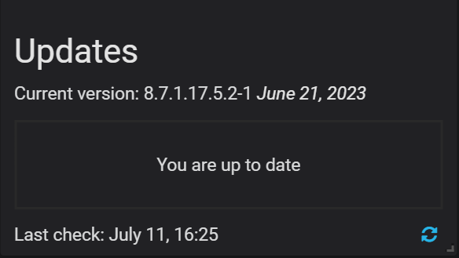

# Terminology Reference

[TOC]

## Data retention

By default, Prometheus stores time-series data for 30 days, and QAN stores query data for 8 days.

Depending on available disk space and your requirements, you may need to adjust data retention time.

You can control data retention by passing the `METRICS_RETENTION` and `QUERIES_RETENTION` environment variables when creating and running the SSM Server container.

## Data Source Name

A database server attribute found on the QAN page. It informs how SSM connects to the selected database.

## Default ports

See [Ports](#ports).

## DSN

See [Data Source Name](#data-source-name)

## External Monitoring Service

A monitoring service which is not provided by SSM directly. It is bound to a running Prometheus exporter. As soon as such an service is added, you can set up the [Metrics Monitor](#metrics-monitor-mm) to display its graphs.

## Grand Total Time

Grand Total Time (percent of grand total time) is the percentage of time that the database server spent running a specific query, compared to the total time it spent running all queries during the selected period of time.

## %GTT

See [Grand Total Time](#grand-total-time)

## Metrics

A series of data which are visualized in SSM.

## Metrics Monitor (MM)

Component of SSM Server that provides a historical view of metrics critical to a MySQL server instance.

## Monitoring service

A special service which collects information from the database instance where [SSM Client](#ssm-client) is installed.

To add a monitoring service, use the [`ssm-admin add`](ssm-admin.md) command.

## Orchestrator

The topology manager for MySQL. By default it is disabled for the [SSM Server](#ssm-server). To enable it, set `ORCHESTRATOR_ENABLED`.

## SSM

Shattered Silicon Monitoring

## ssm-admin

A program which changes the configuration of the [SSM Client](#ssm-client). See detailed documentation in the [Managing SSM Client](ssm-admin.md) section.

## SSM annotation

A feature of SSM Server which adds a special mark to all dashboards and signifies an important event in your application. Annotations are added on the SSM Client by using the **ssm-admin annotate** command.

!!! seealso "See also"

    Grafana Documentation: Annotations
    : <http://docs.grafana.org/reference/annotations/>

## SSM Docker Image

A docker image which enables installing the SSM Server by using **docker**.

!!! seealso "See also"
    Installing SSM Server using Docker
    : [Running SSM Server via Docker](deploy/server/docker.md)

## SSM Client

Collects MySQL server metrics, general system metrics, and query analytics data for a complete performance overview.

The collected data is sent to [SSM Server](#ssm-server).

For more information, see Overview of [Shattered Silicon Monitoring Architecture](architecture.md).

## SSM Home Page

The starting page of the SSM portal from which you can have an overview of your environment, open the tools of SSM, and browse to online resources.

On the SSM home page, you can also find the version number (see [SSM Version](#ssm-version)).

## SSM Server

Aggregates data collected by SSM Client and presents it in the form of tables, dashboards, and graphs in a web interface.

SSM Server combines the backend API and storage for collected data with a frontend for viewing time-based graphs and performing thorough analysis of your MySQL and MongoDB hosts through a web interface.

Run SSM Server on a host that you will use to access this data.

## SSM Server Version

If [SSM Server](#ssm-server) is installed via Docker, you can check the current SSM Server version by running **docker exec**:

Run this command as root or by using the **sudo** command

```
$ docker exec -it ssm-server bash -c 'echo "$SSM_VERSION"'
# 8.7.1.17.5.2-1
```

## SSM user permissions for AWS

When creating a [IAM user](https://docs.aws.amazon.com/AmazonRDS/latest/UserGuide/CHAP_SettingUp.html#CHAP_SettingUp.IAM) for Amazon RDS DB instance that you intend to monitor in SSM, you need to set all required permissions properly. For this, you may copy the following JSON for your IAM user:

```
{
    "Version": "2012-10-17",
    "Statement": [
        {
            "Sid": "Stmt1664804420",
            "Effect": "Allow",
            "Action": [
                "rds:DescribeDBInstances",
                "rds:DescribeDBParameters",
                "rds:DescribeDBLogFiles",
                "rds:DownloadDBLogFilePortion",
                "rds:DescribeDBClusters",
                "rds:DescribeDBClusterParameters",
                "cloudwatch:GetMetricStatistics",
                "cloudwatch:ListMetrics"
            ],
            "Resource": [
                "*"
            ]
        },
        {
            "Sid": "Stmt1664804472",
            "Effect": "Allow",
            "Action": [
                "logs:DescribeLogStreams",
                "logs:GetLogEvents",
                "logs:FilterLogEvents"
            ],
            "Resource": [
                "arn:aws:logs:*:*:log-group:RDSOSMetrics:*"
            ]
        }
    ]
}
```

!!! seealso "See also"
    Creating an IAM user
    : [Creating an IAM user](amazon-rds.md#creating-an-iam-user-with-permission-to-access-amazon-rds-db-instances)

## SSM Version

The version of SSM appears at the bottom of the SSM server home page.



!!! seealso "See also"
    Checking the version of SSM Server
    : [SSM Server Version](#ssm-server-version)

## Ports

The following ports must be open on the SSM client to accept incoming traffic from the SSM Server.

42000
: For SSM to collect general system metrics.

42002
: For SSM to collect MySQL server metrics.

42003
: For SSM to collect MongoDB server metrics.

42004
: For SSM to collect ProxySQL server metrics.

42005
: For SSM to collect PostgreSQL server metrics.

On the SSM Server only ports 80 and/or 443 need to be open for SSM Clients to connect to the SSM web interface and the various APIs, like QAN and prometheus.

!!! seealso "See also"

    Setting up a firewall on CentOS
    : <https://www.digitalocean.com/community/tutorials/how-to-set-up-a-firewall-using-firewalld-on-centos-7>

    Setting up a firewall on Ubuntu
    : <https://www.digitalocean.com/community/tutorials/how-to-set-up-a-firewall-with-ufw-on-ubuntu-16-04>

## QAN

See [Query Analytics (QAN)](#query-analytics-qan)

## Query Abstract

Query pattern with placeholders. This term appears in [Query Analytics (QAN)](#query-analytics-qan) as an attribute of queries.

## Query Analytics (QAN)

Component of SSM Server that enables you to analyze MySQL query performance over periods of time.

## Query ID

A [query fingerprint](#query-fingerprint) which groups similar queries.

## Query Fingerprint

See [Query Abstract](#query-abstract)

## Query Load

The percentage of time that the MySQL server spent executing a specific query.

## Query Metrics Summary Table

An element of [Query Analytics (QAN)](#query-analytics-qan) which displays the available metrics for the selected query.

## Query Metrics Table

A tool within QAN which lists metrics applicable to the query selected in the query summary table.

## Query Summary Table

A tool within QAN which lists the queries which were run on the selected database server during the [selected time or date range](#selected-time-or-date-range).

## Quick ranges

Predefined time periods which are used by QAN to collect metrics for queries. The following quick ranges are available:

* last hour
* last three hours
* last five hours
* last twelve hours
* last twenty four hours
* last five days

## Selected Time or Date Range

A predefined time period (see [Quick ranges](#quick-ranges)), such as 1 hour, or a range of dates that QAN uses to collects metrics.

## Version

A database server attribute found on the QAN page. it informs the full version of the monitored database server, as well as the product name, revision and release number.
