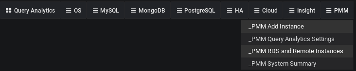
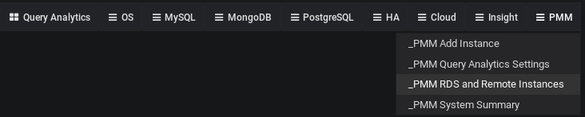

# Adding a MySQL or PostgreSQL Remote DB instance to SSM

There is a quick method for users to add DBaaS instances to SSM without having to hook into the Cloud Provider’s API, and with no need to have SSM Client installed or any exporters running on the monitored node. The drawback of this approach is that you will not have visibility of host-level metrics (CPU, memory, and disk activity will not be captured nor displayed in SSM).

!!! alert alert-info "Note"
    There is an alternative and more complex approach available for MySQL Server, which involves API-aware addition of an Amazon RDS / Aurora DB instance.

Both methods can be accessed in the Metrics Monitor navigation menu by selecting the *SSM Add Instance* item in a SSM Dropdown group:

Two database servers are currently supported by this method: PostgreSQL and MySQL.

## Adding a Remote PostgreSQL Instance

To add a remote PostgreSQL DB instance, you will need to fill in three fields: Hostname, Username, and Password, and optionally override the default Port and Name fields:

## Adding a Remote MySQL Instance

To add a remote MySQL DB instance, you will need to fill in three fields: Hostname, Username, and Password, and optionally override the default Port and Name fields:

## Viewing Remote MySQL and PostgreSQL Instances

Amazon RDS and remote instances can be seen in the RDS and
Remote Instances list, which can be accessed in the Metrics Monitor navigation
menu by selecting the *SSM RDS and Remote Instances* item from the
SSM Dropdown menu:

Remote ones have remote keyword as a Region:

